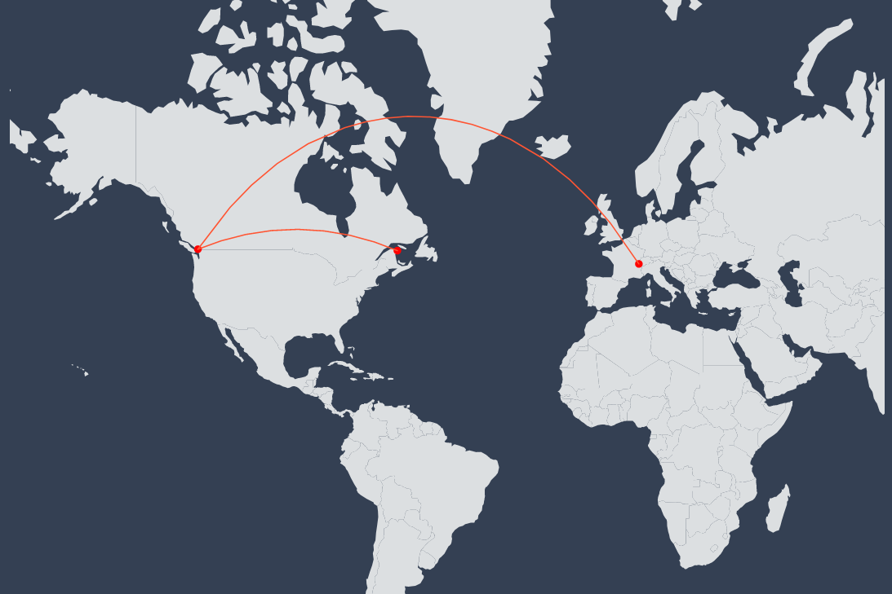

# Food Trust Simulator

A project started during XRPL Hackathon 2022, then funded by XRPL, which attempts to illustrate the interactions and traceability around the food sphere in a blockchain ecosystem proposed by XRPL.

Follow the journey of ingredients from creation to consumers as proof of quality, illustrated with a game. The game popularize supply-chain as well as blockchain concepts through tradeable, earnable
NFTs obtained by playing mini-games and competition with others players.
Personnalize your way of learning by creating a specific profile between Farmer, Manager or Cook. 
Each profile offers a different gaming experience and each ingredient is tracked and displayed in real time on a world map as proof of quality.
In addition to being a game, the goal of this project is to build an educational plateform to teach the fundamentals of the possibilities and capabilities of the blockchain.

## Table of Contents
1. [Dependencies](#dependencies)
2. [How does it work](#how-does-it-work)
3. [Installation and launch](#installation-and-launch)
4. [Documentation](#documentation)
5. [Tests](#test)
6. [Beta](#beta)
7. [In the Future](#in-the-future)
8. [Known issues](#known-issues)
8. [Credits](#credits)
9. [Contributing](#contributing)
10. [License](#license)

## Usage

#### Dependencies

Before running Food Trust Simulator the following dependencies need to be installed.

| Dependencies | Version |
| ------------ | ------- |
| NodeJS       | 14+     |
| MongoDB      | 5+      |


### How does it work

Use your XRPL Account on the web application in pair with game server.
You can connect with Xumm Wallet, Gem Wallet or even a Bridge Wallet that offer the possibility of connecting directly with your identifiers.
Frontend and Backend communicate with XRPLedger, with a WebSocket, to manage the account and maintain consistency.

From a game perspective, you connect into a game by choosing a role in the food sphere of the supply chain.
Then you play to create NFTs (mint) that you can trade with other players to complete a quest and gain levels. Some features you will find are: the ability to merge NFTs from ingredients to the recipe, track each step in the history of an NFT illustrated with a family tree, create a personalized profile, earn badges based on your success, to create Boxes of NFTs, to better understand the transaction, sustainability and transparency in a blockchain context.
The main goal is to be the first to reach level 100.
All the conditions for gaining experience are explained on a scoreboard and a faq.
Discover another way to learn blockchain by playing.

When you mint a new token, it's registered in XRPL and on the game server where the link between them is the generated URI as follow:
```
rNCFjv8Ek5oDrNiMJ3pw6eLLFtMjZLJnf2 1647343480246 000005
+--------------------------------- +------------ +-----
|                                  |             |
|                                  |             `---> Type: Flag to identify token in game
|                                  |`---> Date: Timestamp
`---> Creator: XRPL Account Address
```
On XRPL, see how NFT works: [official XLS-20d Non-Fungible Token documentation](https://github.com/XRPLF/XRPL-Standards/discussions/46).
On Game Server, URI metaData is implemented by following [ERC-1155 Metadata](https://eips.ethereum.org/EIPS/eip-1155).


### Installation and launch

```bash
$ cd front
$ npm install
$ npm start
```

```bash
$ cd server
$ npm install
$ npm run dev
```
If you want an AutoCompletion for location when you Sign Up, before starting the server you can seed it:

```bash
$ cd server
$ npm run seeddb
```

### Documentation

When the server is launched in development mode, you can find Swagger Documentation at localhost:3002/v1/docs/


### Tests
You can find a list of tests for the server, developed with Jest. 
To launch them you need to modify the .env and add two XRPL addresses and two NFT Tokens belonging to the first XRPL address.  
```bash
$ cd server
$ npm run test
```

### Beta

Beta is already launched on Testnet. You can find it [here](https://beta.foodtrustsimulator.app/)
It is hosted on Vercel, MongoDB Atlas and OVH.

### In the Future
Still a lot of ideas that I would like to implement:

| Ideas        |
|--------------|
| Deadline for offers |
| New and more mini-games |
| Each user can choose the color from the collection that updates their profile color point on the map | 
| Add more information on-chain with the URI |
| Mint for other player |
| Personnal Items for picture profil will be NFTs assets |
| Develop a transfer fee strategie for players |
| Create an Escrow strategie |
| Issue a fungible token dedicate for the game |
| Sort collection by longevity |

### Known issues
To be corrected in the next version. 

| Issues       |
|--------------|
| Some elements are not yet responsive |
| When you accept an offer from a remote token, the remote profile is not updated |
| When you do a sell offer lower than a buy offer the NFT became invalide on-game |
| Quest limitation is sometime NaN |
| Insufficient fund on Xumm |


Find an issue ? Contact us at contact@foodtrustsimulator.app

## Credits
Some awesome libraries/projects help power this one:

* [P5](https://github.com/processing/p5.js/), for mini-games
* [React-Simple-Maps](https://github.com/zcreativelabs/react-simple-maps), for WorldMap design and interactions
* [Material-UI](https://github.com/mui/material-ui), for the global design of the web app
* [TypeScript](https://www.typescriptlang.org/), write JS with syntax for types
* [Express](http://expressjs.com/) - Fast node.js network app framework
* [Node.js](http://nodejs.org/) - Evented I/O for the backend
* [Reactjs](https://reactjs.org) - Library for building user interfaces
* [Front Boilerplate](https://github.com/codesbiome/react-webpack-typescript-2022)
* [Server Boilerplate](https://github.com/codesbiome/react-webpack-typescript-2022)
* [List of Cities](https://github.com/lutangar/cities.json)

## Contributing
Pull requests are welcome. For major changes, please open an issue first to discuss what you would like to change.
Please make sure to update tests as appropriate.

## License
[MIT](https://choosealicense.com/licenses/mit/)

##


